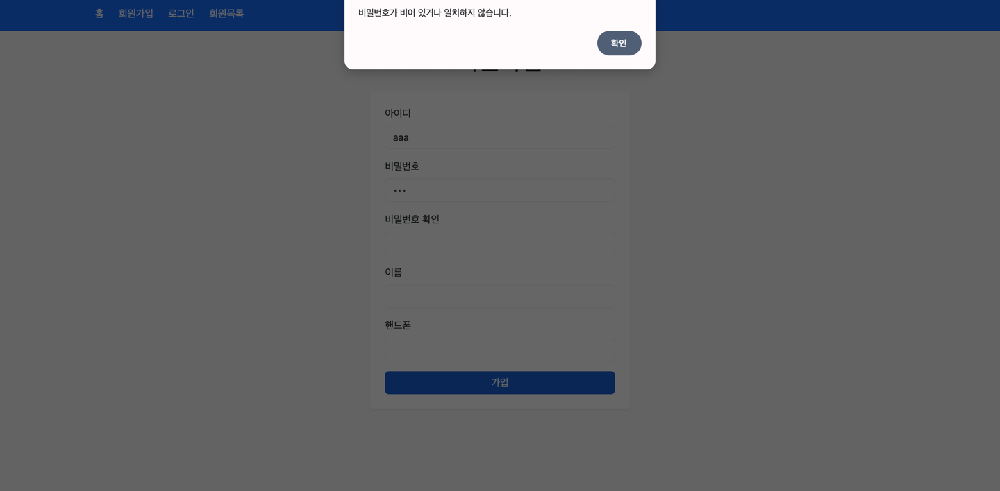
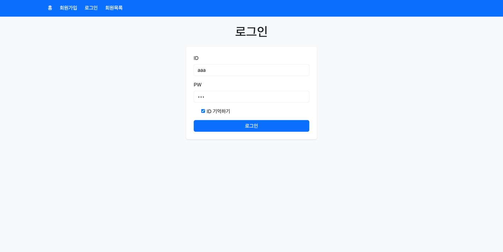
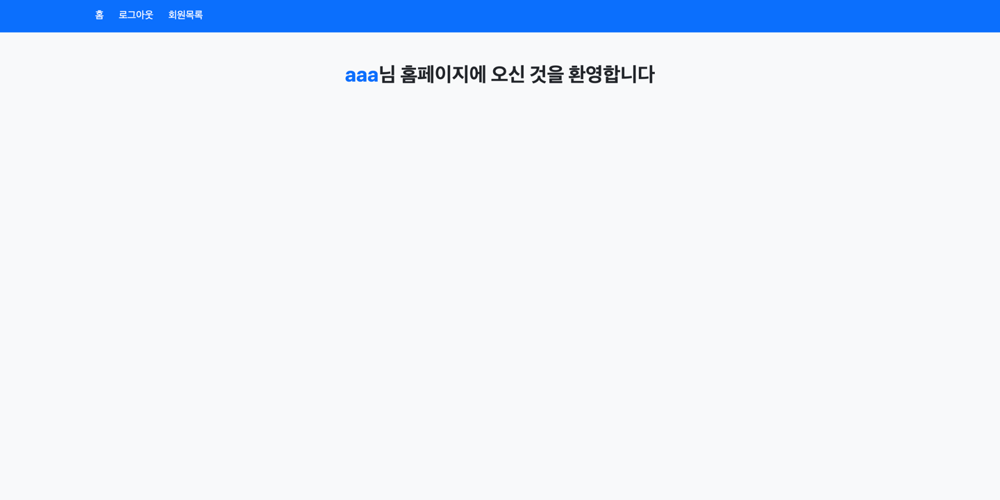
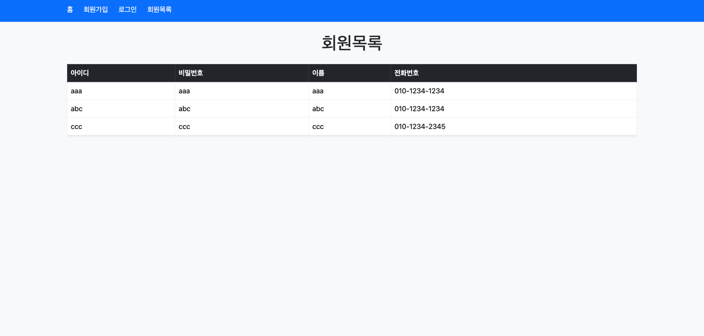

# 📘 scit 48기 백엔드 과제1: Spring Boot 회원 관리 시스템

Spring Boot + Thymeleaf를 이용하여 구현한  
**회원가입 · 로그인 · 로그아웃 · 회원목록 조회** 기능을 가진 간단한 웹 프로젝트입니다.

---

# ✨ 주요 기능

## 1️⃣ 회원가입 (Sign Up)
- ID, PW, 이름, 전화번호 입력
- JavaScript로 유효성 검사
- 회원가입 시 ID가 세션에 저장됨

## 2️⃣ 로그인 (Login)
- 세션에 저장된 ID/PW 기반으로 로그인 확인
- 로그인 성공 시 세션에 `loginId` 저장
- **ID 기억하기(localStorage)** 기능 포함  
  → 체크하면 다음 로그인 때 자동으로 ID 입력됨

## 3️⃣ 로그아웃 (Logout)
- 세션 invalidate()로 로그아웃 처리
- 로그아웃 후 홈 화면으로 이동

## 4️⃣ 회원목록 조회 (User List)
- DB에 저장된 모든 회원 목록을 테이블로 출력
- Bootstrap을 사용해 테이블 UI 구성

## 5️⃣ 공통 배너 (Header)
- Thymeleaf fragment로 구현
- 로그인 여부에 따라 메뉴 자동 변경

### 로그인 전:
- 홈 / 회원가입 / 로그인

### 로그인 후:
- 홈 / 로그아웃 / 회원목록

---

# 🛠 기술 스택

### Environment

### Backend

### Frontend

### Database

  